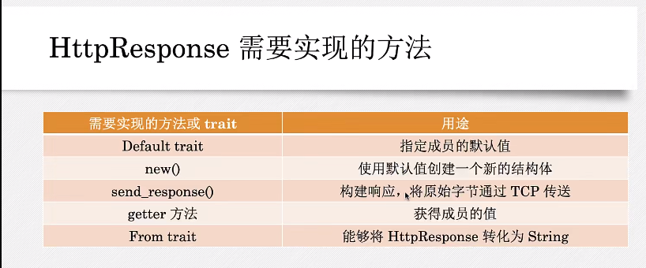

### Rust Web全栈
1. #### client客户端

2. #### server服务端
       server服务端需要引用http模块，http模块中包含两个请求和响应模块

3. #### http请求体需要实现的trait
```makefile
      http请求报文格式:
        GET /index.html HTTP/1.1     //METHOD GREETING HTTP_VERSION
        
        Host: www.rust-lang.org     //HEASDER LINES
        User-Agent: curl/7.64.1
        Accept: */*
         
        "xxxxxx"                    //BODY
      
```
4. #### http响应体需要实现的trait
